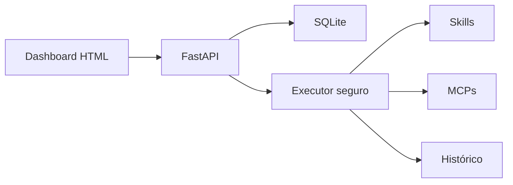

# AI Automation Hub

[](https://github.com/viniciusds2020/ai-automation-hub/actions/workflows/quality.yml)
[](https://python.org)
[](https://fastapi.tiangolo.com)

Painel visual para organizar Skills, servidores MCP e workflows de automação com IA. O MVP oferece catálogo, composição de processos, execução simulada e histórico auditável em uma interface web responsiva.


## Arquitetura



## Recursos

- dashboard com métricas de operação;
- catálogo unificado de Skills e servidores MCP;
- criação de workflows;
- execução e histórico;
- API documentada em OpenAPI;
- persistência SQLite;
- interface sem framework ou etapa de build;
- Docker Compose;
- testes e GitHub Actions;
- modo de simulação seguro por padrão.

## Segurança do MVP

Esta versão **não executa comandos arbitrários, código de Skills ou conexões MCP reais**. Cada etapa é validada e executada em modo simulação. Para produção, implemente adaptadores com allowlist, autenticação, isolamento, limites de tempo, gestão de segredos e aprovação humana.

## Executar localmente

```bash
python -m venv .venv
source .venv/bin/activate
pip install -e ".[dev]"
automation-hub
```

Acesse:

- interface: http://localhost:8000
- Swagger: http://localhost:8000/docs
- health check: http://localhost:8000/health

## Docker

```bash
docker compose up --build
```

O banco é persistido no volume `hub-data`.

## API

| Método | Endpoint | Função |
|---|---|---|
| GET | `/api/dashboard` | métricas |
| GET/POST | `/api/resources` | Skills e MCPs |
| GET/POST | `/api/workflows` | workflows |
| POST | `/api/workflows/{id}/run` | execução simulada |
| GET | `/api/runs` | histórico |

## Testes

```bash
ruff check src tests
pytest --cov=automation_hub
```

## Roadmap

- [ ] adaptador MCP via stdio e HTTP com allowlist;
- [ ] importação de Skills por manifesto;
- [ ] editor visual com múltiplas etapas;
- [ ] Groq/Llama como provedor opcional;
- [ ] agendamento e filas assíncronas;
- [ ] autenticação e perfis de acesso;
- [ ] cofre externo de segredos;
- [ ] métricas de tokens, custo e latência;
- [ ] aprovação humana antes de ações sensíveis.

## Autor

Desenvolvido por [Vinicius de Sousa](https://github.com/viniciusds2020).

